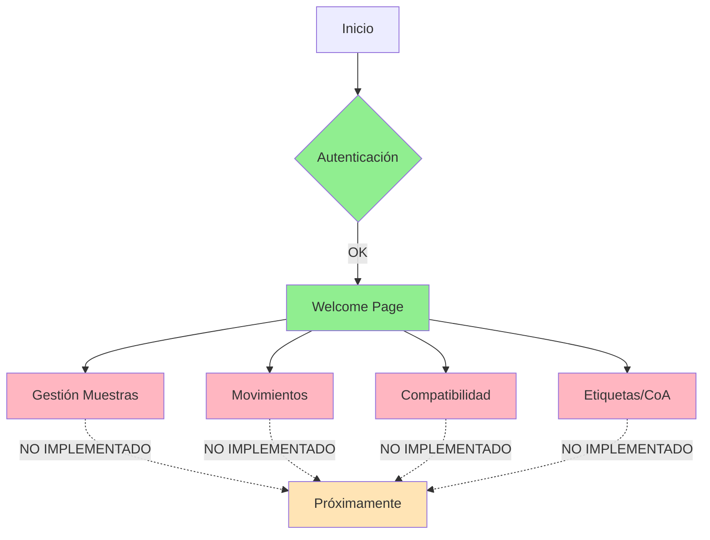

# Informe de Análisis Completo del Proyecto Händler TrackSamples

## Resumen Ejecutivo

Este documento presenta un análisis exhaustivo del estado actual del proyecto **Händler TrackSamples** en comparación con la planificación definida en [`plan_completo.md`](HändlerTrackSamples/Analisis%20y%20progreso/plan_completo.md) y la plantilla de planificación.

El proyecto se encuentra en un estado de **desarrollo incompleto** (~30-35% implementado). La autenticación y gestión de usuarios están operativas, pero los módulos principales de gestión de muestras, movimientos y compatibilidad química no están implementados en el código.

---

## 1. Análisis Comparativo: Plan vs. Implementación

### 1.1 Arquitectura согласно Plan

| Componente | Plan Propuesto | Estado Actual | Implementado |
|-------------|----------------|----------------|--------------|
| **Backend Framework** | FastAPI | FastAPI ✓ | 100% |
| **Base de Datos** | MySQL | MySQL (configurado) | 100% |
| **ORM** | SQLAlchemy | SQLAlchemy ✓ | 100% |
| **Validación** | Pydantic | Pydantic ✓ | 100% |
| **Frontend** | Electron + React/Vue | Electron + React | 80% |
| **UI Framework** | Material-UI o Tailwind | Material-UI v5 | 100% |

### 1.2 Módulos Funcionales

| Módulo | Plan | Estado Actual | % Completado |
|--------|------|---------------|--------------|
| Gestión de Catálogo (CRUD muestras) | ✓ Planificado | NO IMPLEMENTADO | 0% |
| Importación desde Excel | ✓ Planificado | NO IMPLEMENTADO | 0% |
| Búsqueda en tiempo real | ✓ Planificado | NO IMPLEMENTADO | 0% |
| Sistema de Localización [ZONA]-[ESTANTE]-[NIVEL]-[POSICIÓN] | ✓ Planificado | NO IMPLEMENTADO | 0% |
| Mapa Visual Interactivo | ✓ Planificado | NO IMPLEMENTADO | 0% |
| Alertas de Compatibilidad Química | ✓ Planificado | NO IMPLEMENTADO | 0% |
| Generación de Etiquetas | ✓ Planificado | NO IMPLEMENTADO | 0% |
| Visualizador de CoA | ✓ Planificado | NO IMPLEMENTADO | 0% |
| Exportación de Reportes | ✓ Planificado | NO IMPLEMENTADO | 0% |
| Sistema de Backups Automáticos | ✓ Planificado | Script existente | 80% |
| Autenticación y Control de Acceso | ✓ Planificado | ✓ Implementado | 95% |

---

## 2. Estado Detallado del Backend

### 2.1 Estructura de Archivos

```
backend/
├── main.py                    ✓ OPERATIVO (215 líneas)
├── database/
│   └── database.py            ✓ OPERATIVO (25 líneas)
├── models/
│   ├── user.py                ✓ OPERATIVO (20 líneas)
│   ├── sample.py              ✗ NO EXISTE
│   ├── movement.py            ✗ NO EXISTE
│   └── chemical_compatibility.py ✗ NO EXISTE
├── schemas/
│   └── __init__.py            ✓ OPERATIVO (80 líneas)
├── security/
│   └── __init__.py            ✓ OPERATIVO (64 líneas)
├── routers/                   ✗ NO EXISTE (directorio vacío)
├── alembic/
│   ├── env.py                ⚠️ INCOSISTENTE (importa modelos que no existen)
│   └── versions/
│       └── 001_initial.py     ✓ CREA TODAS LAS TABLAS
└── scripts/
    └── backup_handler.ps1     ✓ OPERATIVO (358 líneas)
```

### 2.2 Modelos de Datos - Análisis

#### ✅ Modelo Implementado: User
- **Ubicación**: [`models/user.py`](HändlerTrackSamples/backend/models/user.py:1)
- **Campos**: id, username, email, hashed_password, full_name, role, is_active, last_login, created_at, updated_at
- **Roles**: admin, supervisor, operator, viewer
- **Estado**: Completo y funcional

#### ❌ Modelos NO Implementados (referenciados en migración)

| Modelo | Tabla BD | Schemas | Routers | Servicios |
|--------|----------|---------|---------|-----------|
| Sample | ✓ Existe | ✗ No hay | ✗ No hay | ✗ No hay |
| Movement | ✓ Existe | ✗ No hay | ✗ No hay | ✗ No hay |
| ChemicalCompatibility | ✓ Existe | ✗ No hay | ✗ No hay | ✗ No hay |

**Problema Crítico**: En [`alembic/env.py:19-21`](HändlerTrackSamples/backend/alembic/env.py:19) se importan:
```python
from models.sample import Sample      # ✗ NO EXISTE
from models.movement import Movement   # ✗ NO EXISTE
from models.chemical_compatibility import ChemicalCompatibility  # ✗ NO EXISTE
```

### 2.3 Endpoints API - Estado

| Endpoint | Método | Estado | Ruta |
|----------|--------|--------|------|
| Raíz API | GET / | ✓ Operativo | [`main.py:81`](HändlerTrackSamples/backend/main.py:81) |
| Login | POST /login/ | ✓ Operativo | [`main.py:125`](HändlerTrackSamples/backend/main.py:125) |
| Mi Usuario | GET /users/me | ✓ Operativo | [`main.py:161`](HändlerTrackSamples/backend/main.py:161) |
| Crear Usuario | POST /users/ | ✓ Operativo | [`main.py:93`](HändlerTrackSamples/backend/main.py:93) |
| Cambiar Contraseña | POST /users/change-password | ✓ Operativo | [`main.py:168`](HändlerTrackSamples/backend/main.py:168) |
| Health Check | GET /health | ✓ Operativo | [`main.py:212`](HändlerTrackSamples/backend/main.py:212) |
| CRUD Muestras | POST/GET/PUT/DELETE /samples/ | ✗ NO IMPLEMENTADO | - |
| Importar Excel | POST /samples/import-excel | ✗ NO IMPLEMENTADO | - |
| Movimientos | POST/GET /movements/ | ✗ NO IMPLEMENTADO | - |
| Compatibilidad | GET /compatibility/ | ✗ NO IMPLEMENTADO | - |

---

## 3. Estado Detallado del Frontend

### 3.1 Estructura de Archivos

```
frontend/
├── package.json                ✓ Configurado
├── public/
│   └── index.html              ✓ exists
└── src/
    ├── App.js                  ✓ OPERATIVO (132 líneas)
    ├── index.js                ✓ OPERATIVO
    ├── components/
    │   ├── InfoPanel.jsx       ✓ OPERATIVO (21,193 líneas)
    │   ├── InteractiveButtons.js ✓ OPERATIVO
    │   ├── Layout.js           ✓ OPERATIVO (16,025 líneas)
    │   └── LoginForm.js         ✓ OPERATIVO (4,298 líneas)
    ├── pages/
    │   ├── Login.js            ✓ OPERATIVO
    │   ├── Welcome.js          ✓ OPERATIVO (486 líneas - "Próximamente")
    │   └── ChangePassword.js   ✓ OPERATIVO (16,053 líneas)
    ├── context/
    │   └── AuthContext.js      ✓ OPERATIVO
    ├── services/
    │   └── api.js              ✓ OPERATIVO
    ├── constants/
    │   └── theme.js            ✓ OPERATIVO
    └── main/
        ├── main.js             ✓ OPERATIVO (Electron)
        └── preload.js          ✓ OPERATIVO
```

### 3.2 Dependencias Instaladas

| Dependencia | Versión | Estado |
|-------------|---------|--------|
| React | 18.2.0 | ✓ |
| Electron | 33.0.0 | ✓ |
| Material-UI | 5.15.0 | ✓ |
| Axios | 1.6.0 | ✓ |
| React Router | 6.21.0 | ✓ |
| QRCode | 1.5.3 | ✓ (sin usar) |
| Recharts | 2.10.0 | ✓ (sin usar) |

### 3.3 UI - Estado de Funcionalidades

#### ✅ Funcionalidades Operativas
1. **Login** - Formulario de autenticación funcional
2. **Cambio de Contraseña** - Interfaz completa
3. **Bienvenida** - Página informativa con animaciones
4. **Protección de Rutas** - AuthContext implementado
5. **Manejo de Tokens** - Cookies con HttpOnly simulation

#### ❌ Funcionalidades NO Operativas (marcadas como "Próximamente")

Según [`Welcome.js:181-210`](HändlerTrackSamples/frontend/src/pages/Welcome.js:181):
| Funcionalidad | Descripción | Estado |
|---------------|-------------|--------|
| Gestión de Muestras | CRUD completo | ⚠️ Próximamente |
| Control de Compatibilidad | Verificación química | ⚠️ Próximamente |
| Movimientos | Entradas y salidas | ⚠️ Próximamente |
| Alertas Inteligentes | Stock, vencimiento | ⚠️ Próximamente |

#### ❌ Accesos Rápidos Deshabilitados

Según [`Welcome.js:212-241`](HändlerTrackSamples/frontend/src/pages/Welcome.js:212):
| Acceso | Estado |
|--------|--------|
| Bodega | ✗ Deshabilitado |
| Búsqueda | ✗ Deshabilitado |
| Etiquetas | ✗ Deshabilitado |
| Análisis | ✗ Deshabilitado |

---

## 4. Scripts y Utilitarios

### 4.1 Scripts del Proyecto

| Script | Ubicación | Estado | Observaciones |
|--------|-----------|--------|---------------|
| Inicialización BD | [`scripts/database_init.py`](HändlerTrackSamples/scripts/database_init.py) | ⚠️ INCOSISTENTE | Intenta importar modelos que no existen |
| Crear Usuario Admin | [`scripts/create_initial_user.py`](HändlerTrackSamples/scripts/create_initial_user.py) | ✓ Operativo | Requiere datetime import |
| Backup PowerShell | [`backend/scripts/backup_handler.ps1`](HändlerTrackSamples/backend/scripts/backup_handler.ps1) | ✓ Operativo | 358 líneas, completo |
| Test MySQL | [`scripts/test_mysql_connection.py`](HändlerTrackSamples/scripts/test_mysql_connection.py) | ✓ Existe |
| Instalación | [`scripts/installation.bat`](HändlerTrackSamples/scripts/installation.bat) | ✓ Existe |
| Start All | [`start_all.bat`](HändlerTrackSamples/start_all.bat) | ✓ Operativo |

### 4.2 Issues en Scripts

**Problema en [`database_init.py:64-67`](HändlerTrackSamples/scripts/database_init.py:64)**:
```python
from models.sample import Sample              # ✗ NO EXISTE
from models.movement import Movement           # ✗ NO EXISTE
from models.chemical_compatibility import ChemicalCompatibility  # ✗ NO EXISTE
```

**Problema en [`create_initial_user.py:74`](HändlerTrackSamples/scripts/create_initial_user.py:74)**:
```python
f.write(f"Fecha: {datetime.now().isoformat()}\n")  # ✗ datetime no está importado al inicio
```

---

## 5. Documentación vs Realidad

### 5.1 Análisis del README.md

El archivo [`README.md`](README.md:1) afirma:

| Afirmación | Realidad |
|------------|----------|
| "Gestión de Catálogo" | ✗ NO IMPLEMENTADO |
| "Localización Física" | ✗ NO IMPLEMENTADO |
| "Compatibilidad Química" | ✗ NO IMPLEMENTADO |
| "Mapa Visual" | ✗ NO IMPLEMENTADO |
| "Documentación: etiquetas y CoA" | ✗ NO IMPLEMENTADO |
| "Búsqueda en tiempo real" | ✗ NO IMPLEMENTADO |
| "Carga Masiva: Excel" | ✗ NO IMPLEMENTADO |
| "Backups Automáticos" | ✓ Script existente |
| "Versión: EN PRODUCCIÓN (90%)" | ⚠️ INCORRECTO - ~30-35% |

---

## 6. Hallazgos Críticos

### 6.1 Inconsistencias严重

| # | Inconsistencia | Severidad | Ubición |
|---|----------------|-----------|---------|
| 1 | Modelos referenciados no existen | **CRÍTICA** | alembic/env.py |
| 2 | Schemas para Sample/Movement no existen | **CRÍTICA** | backend/schemas/ |
| 3 | Routers no existen | **CRÍTICA** | backend/routers/ |
| 4 | Frontend muestra funcionalidades "Próximamente" | **ALTA** | Welcome.js |
| 5 | README声称90% completado | **ALTA** | README.md |
| 6 | Scripts importan modelos inexistentes | **ALTA** | database_init.py |

### 6.2 Código Huérfano

| Archivo | Tipo | Estado |
|---------|------|--------|
| qrcode (dependencia) | npm | Instalado pero sin usar |
| recharts (dependencia) | npm | Instalado pero sin usar |
| openpyxl (dependencia) | pip | Instalado pero sin uso en código |
| backend/routers/ | directorio | Vacío |

---

## 7. Recomendaciones

### 7.1 Acciones Inmediatas (Limpieza)

| # | Acción | Prioridad | Razón |
|---|--------|-----------|-------|
| 1 | Eliminar imports de modelos inexistentes en alembic/env.py | **ALTA** | Causará errores al ejecutar migraciones |
| 2 | Eliminar imports de modelos inexistentes en database_init.py | **ALTA** | Script no funcionará |
| 3 | Corregir import datetime en create_initial_user.py | **MEDIA** | Error de sintaxis |
| 4 | Actualizar README.md con estado real (~30%) | **ALTA** | Documentación engañosa |
| 5 | Eliminar dependencias innecesarias (qrcode, recharts, openpyxl) o documentar uso futuro | **BAJA** | Optimización |

### 7.2 Implementación Pendiente (Siguiente Fase)

Según el plan original, completar:

| # | Módulo | Pasos |
|---|--------|-------|
| 1 | Modelos de Datos | Crear sample.py, movement.py, chemical_compatibility.py |
| 2 | Schemas | Crear schemas para cada modelo |
| 3 | CRUD Muestras | Implementar endpoints REST |
| 4 | Importación Excel | Crear endpoint de importación |
| 5 | Movimientos | Registrar entradas/salidas |
| 6 | Compatibilidad Química | Lógica de alertas |
| 7 | Frontend | Activar páginas de gestión |

### 7.3 Diagrama de Estado Actual



---

## 8. Conclusión

El proyecto **Händler TrackSamples** se encuentra en un estado de **desarrollo parcial**:

- **Lo que funciona**: Autenticación, gestión de usuarios, sistema de login/logout, estructura base de Electron+React
- **Lo que falta**: Todo el núcleo del negocio (muestras, movimientos, compatibilidad química, etiquetas, CoA, reportes)
- **Estado real**: ~30-35% completado (NO 90% como dice el README)
- **acción requerida**: 
  1. Limpiar inconsistencias
  2. Completar modelos y endpoints
  3. Desarrollar frontend completo

---

*Informe generado: 2026-03-12*
*Proyecto: Händler TrackSamples v1.0*
